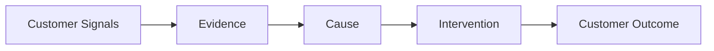
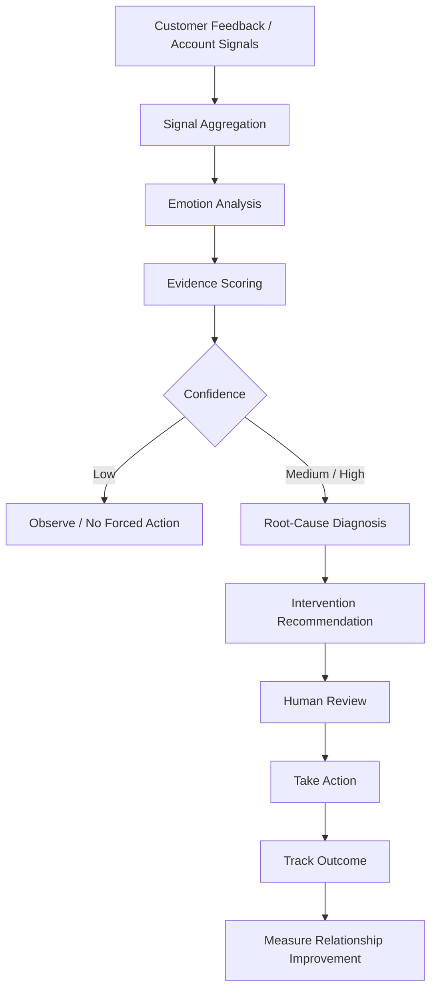
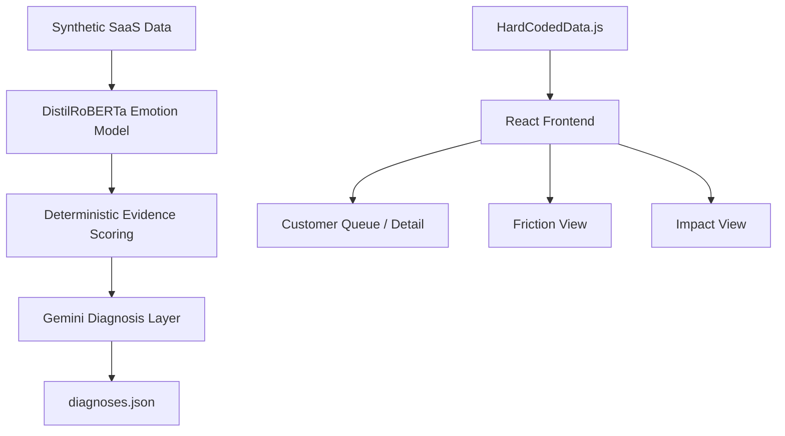
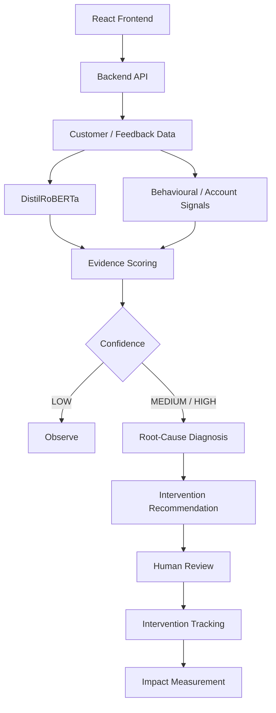
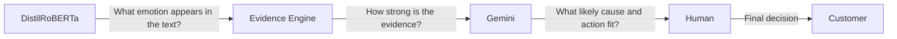
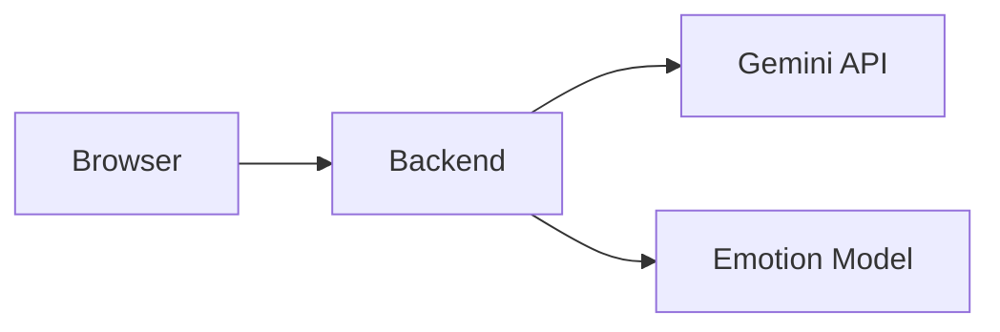
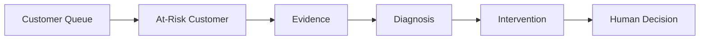

# Re-Engage

> **Understand the customer. Detect disengagement. Diagnose the cause. Take meaningful action.**

**DevLeague 2026 — Lab 4: Customer Experience & Engagement**

[](#)
[](#2-lab-addressed)
[](#development-status)
[](#9-tech-stack)
[](#9-tech-stack)
[](#8-ai-models)

---

## Quick Navigation

* [Project Overview](#1-project-overview)
* [Lab Addressed](#2-lab-addressed)
* [Problem Statement](#3-problem-statement)
* [Proposed Solution](#4-proposed-solution)
* [How It Works](#5-how-it-works)
* [Core Features](#6-core-features)
* [Architecture](#7-architecture)
* [AI Models](#8-ai-models)
* [Tech Stack](#9-tech-stack)
* [Repository Structure](#10-repository-structure)
* [Setup](#11-setup)
* [Installation](#12-installation)
* [Environment Variables](#13-environment-variables)
* [Run Instructions](#14-run-instructions)
* [API Documentation](#15-api-documentation)
* [Demo Data](#16-demo-data)
* [Research & Validation](#17-research--validation)
* [Responsible AI](#18-responsible-ai)
* [Limitations](#19-limitations)
* [Team Responsibilities](#20-team-responsibilities)
* [Live Demo](#21-live-demo)
* [Demo Video](#22-demo-video)
* [Devpost](#23-devpost-link)

---

# 1. Project Overview

**Re-Engage** is an AI-assisted customer engagement and retention decision-support platform developed for **DevLeague 2026**.

Customers often do not disappear overnight.

Before leaving, they may show signals such as declining engagement, repeated complaints, unresolved friction, unmet expectations, changes in behaviour, or emotional signals indicating that their relationship with a business is weakening.

Re-Engage helps businesses recognise these signals earlier and answer three questions:

> ### Who is disengaging?
>
> ### Why are they disengaging?
>
> ### What can we do about it?

Our core workflow is:

```text
UNDERSTAND → DETECT → DIAGNOSE → ACT → MEASURE
```

Rather than producing only a churn probability, Re-Engage attempts to connect:

> **Customer Signal → Evidence → Cause → Meaningful Intervention**

The project is currently a **working proof of concept under active integration**.

---

# 2. Lab Addressed

## Lab 4 — Customer Experience & Engagement

Re-Engage directly addresses **DevLeague Lab 4: Customer Experience & Engagement — The Moment Before They Leave**.

The Lab 4 problem recognises that winning a customer is only the beginning.

Customers rarely disappear suddenly. Before leaving, businesses may observe:

* declining usage;
* changing behaviour;
* reduced engagement;
* unmet expectations;
* moments of friction;
* weakening customer relationships.

The challenge is not only to predict churn.

DevLeague asks teams to consider:

* **Detecting early signals** — When is a customer beginning to disengage?
* **Understanding why** — What is causing the decline in engagement?
* **Creating meaningful interventions** — What can the business do to improve the relationship?
* **Personalising retention** — Should different customers receive different responses?
* **Building loyalty** — How can businesses create relationships customers want to maintain?
* **Preventing silent churn** — How can businesses identify customers who are still technically active but already disengaging?

The central challenge is:

> **Don't just predict who will leave. Find a way to give them a reason to stay.**

Re-Engage is designed specifically around this principle.

---

# 3. Problem Statement

## The Moment Before They Leave

Customer churn is often the **final outcome of a deterioration process**, not the first signal.

A customer may remain technically active while their relationship with the business is already weakening.

They may:

* complain repeatedly about the same issue;
* gradually use the product less;
* become less responsive;
* fail to realise expected product value;
* experience a mismatch between their needs and their plan;
* become frustrated with unresolved friction;
* question whether the product remains worthwhile;
* stop feeling that anyone within the business understands or owns their problem.

Traditional churn approaches often focus on:

> **"Which customer is likely to leave?"**

But that does not necessarily tell a Customer Success team what to do next.

A useful customer-retention system should instead help businesses answer:

### 1. Who is disengaging?

Identify customers whose behaviour, engagement, feedback, or experience suggests the relationship may be weakening.

### 2. Why are they disengaging?

Identify meaningful possible causes rather than relying only on a generic risk score.

### 3. What can we do about it?

Recommend an intervention that addresses the underlying customer problem and creates genuine value.

The problem therefore becomes:

> **Can we understand the customer early enough to take meaningful action before disengagement becomes churn?**

---

# 4. Proposed Solution

Re-Engage transforms customer signals into explainable retention decisions.

The system is designed to:

1. analyse customer feedback and available account signals;
2. detect emotional signals in customer text;
3. aggregate supporting evidence;
4. calculate evidence confidence;
5. identify the likely cause of disengagement;
6. recommend an intervention aligned with that cause;
7. explain why alternative interventions may be unsuitable;
8. keep a human involved in the final decision;
9. track whether the intervention improves the relationship.

## The Core Idea



### Example

A customer repeatedly complains that an export feature still does not work.

Instead of returning:

> **High churn risk**

Re-Engage aims to provide:

| Decision Layer     | Result                                                    |
| ------------------ | --------------------------------------------------------- |
| Signal             | Repeated negative feedback                                |
| Emotion            | Strong negative emotional signal                          |
| Evidence           | Same problem reported across multiple interactions        |
| Confidence         | High                                                      |
| Diagnosis          | Unresolved Friction                                       |
| Recommended Action | Technical workaround / escalation                         |
| Rejected Action    | Discount                                                  |
| Why Rejected       | A lower price does not fix the underlying product problem |

---

# 5. How It Works

## From Customer Understanding to Relationship Improvement



## Stage 1 — Understand

Customer feedback and available account information are collected.

Possible signals include:

* textual feedback;
* repeated complaints;
* contact history;
* emotional signals;
* usage or account information where available.

## Stage 2 — Detect

Re-Engage looks for evidence that suggests customer disengagement.

A single negative statement should not automatically trigger aggressive retention activity.

## Stage 3 — Score Confidence

Evidence is weighted before diagnosis.

Current backend confidence tiers are:

| Confidence | Current Backend Threshold | Meaning                          |
| ---------- | ------------------------: | -------------------------------- |
| **HIGH**   |                       ≥ 8 | Strong evidence                  |
| **MEDIUM** |                       ≥ 6 | Requires review                  |
| **LOW**    |                       < 6 | Observe rather than force action |

## Stage 4 — Diagnose

The system attempts to identify the likely underlying problem.

Current diagnostic categories:

* **Unresolved Friction**
* **Unrealised Value**
* **Wrong Fit**
* **Value Doubt**
* **Relationship Gap**

## Stage 5 — Recommend

The diagnosis is mapped to an intervention intended to address the customer's actual need.

| Cause               | Possible Intervention             |
| ------------------- | --------------------------------- |
| Unresolved Friction | Workaround / technical escalation |
| Unrealised Value    | Guided setup                      |
| Wrong Fit           | Plan adjustment / downgrade       |
| Value Doubt         | Demonstrate realised value        |
| Relationship Gap    | Named human ownership             |

## Stage 6 — Human Review

Re-Engage is designed as a **decision-support system**.

AI supports the decision.

A human remains responsible for the final customer intervention.

## Stage 7 — Measure

The intended final loop measures whether the action improved:

* engagement;
* issue resolution;
* usage;
* customer response;
* retention;
* relationship quality.

---

# 6. Core Features

## Customer Queue

A prioritised operational view of accounts needing attention.

**Current prototype includes:**

* search;
* diagnosis filtering;
* confidence filtering;
* customer value;
* diagnosis;
* confidence status;
* recommended action;
* customer navigation.

---

## Customer Detail

Provides the reasoning behind the system's recommendation.

Displays:

* customer context;
* diagnosis;
* confidence;
* need state;
* evidence;
* recommended intervention;
* intervention cost;
* reversibility;
* rejected interventions;
* customer timeline.

---

## Emotion Analysis

Customer text is analysed using:

```text
j-hartmann/emotion-english-distilroberta-base
```

Supported classes:

`anger` · `disgust` · `fear` · `joy` · `neutral` · `sadness` · `surprise`

---

## Evidence Scoring

Emotion is **not used as churn probability**.

Instead, Re-Engage combines evidence before deciding whether further diagnosis is justified.

---

## Root-Cause Diagnosis

The system attempts to distinguish *why* a customer may be disengaging.

### Unresolved Friction

> "I am trying to use this, but something keeps blocking me."

### Unrealised Value

> "I bought this, but I am not getting what I expected."

### Wrong Fit

> "This product or plan does not match what I actually need."

### Value Doubt

> "I am no longer sure this is worth continuing."

### Relationship Gap

> "Nobody seems to understand or own my problem."

---

## Intervention Recommendation

The system recommends a response designed to match the cause.

Possible interventions currently include:

* micro-guide / workaround;
* Customer Success setup;
* named human ownership;
* engineering fix;
* proactive downgrade;
* discount.

---

## Rejected-Action Reasoning

Re-Engage can also explain why another intervention may be inappropriate.

```text
Recommended:
Engineering fix

Rejected:
Discount

Reason:
The customer has a product-functionality problem,
not a pricing problem.
```

---

## Friction View

Designed to reveal recurring customer problems across multiple accounts.

This allows Re-Engage to move from:

> **One unhappy customer**

toward:

> **A recurring product problem affecting many customers**

---

## Impact View

Designed to show whether interventions improve customer outcomes.

**Current impact data is prototype/demo data and should not be interpreted as proven real-world retention performance.**

---

# 7. Architecture

## Current Repository Architecture



> **Current integration gap:** the React frontend still relies primarily on hardcoded demo records rather than the generated backend analysis.

## Target MVP Architecture



---

# 8. AI Models

## Emotion Model

### `j-hartmann/emotion-english-distilroberta-base`

Used for emotion classification of English text.

The current wrapper supports:

* single-text inference;
* batch inference;
* model caching;
* scores for every available emotion label.

### Important Interpretation

If the model returns:

```json
{
  "anger": 0.82
}
```

this means:

> The model assigned approximately 82% confidence to the **anger emotion class** for that text.

It does **not** mean:

> The customer has an 82% probability of churning.

---

## Gemini

Gemini is used as a constrained diagnosis and intervention reasoning layer.

It must select from predefined:

* diagnoses;
* customer need states;
* actions.

The backend validates its structured output.

Gemini may also return:

```text
No confident diagnosis
No recommended action
```

rather than being forced to guess.

---

## Why Hybrid AI?

Re-Engage deliberately separates responsibilities.



This prevents a single generative AI model from making the entire decision.

---

# 9. Tech Stack

| Area                | Technology                   |
| ------------------- | ---------------------------- |
| Frontend            | React 18                     |
| Navigation          | React Router                 |
| Frontend Language   | JavaScript                   |
| Backend             | Python                       |
| Emotion AI          | Hugging Face Transformers    |
| Emotion Model       | DistilRoBERTa                |
| Generative AI       | Google Gemini                |
| ML Runtime          | PyTorch                      |
| Data Processing     | Pandas                       |
| Schema Validation   | Pydantic                     |
| Configuration       | python-dotenv                |
| Progress Processing | tqdm                         |
| Source Control      | Git / GitHub                 |
| Dataset             | Synthetic SaaS customer data |

---

# 10. Repository Structure

```text
BigOofNotation/
│
├── app/
│   ├── public/
│   │
│   ├── src/
│   │   ├── components/
│   │   ├── constants/
│   │   ├── data/
│   │   ├── hooks/
│   │   ├── pages/
│   │   ├── styles/
│   │   ├── App.jsx
│   │   └── HardCodedData.js
│   │
│   ├── package.json
│   └── package-lock.json
│
├── backend/
│   ├── aggregate.py
│   ├── emotion_model.py
│   ├── gemini_diagnose.py
│   ├── pipeline.py
│   ├── run_batch.py
│   ├── scoring.py
│   ├── taxonomy.py
│   ├── requirements.txt
│   └── .env.example
│
├── data/
│
├── HANDOFF_FRICTION_IMPACT.md
├── README.md
├── LICENSE
├── .gitignore
└── .gitattributes
```

## Backend Responsibilities

<details>
<summary><strong>emotion_model.py</strong></summary>

Wraps `j-hartmann/emotion-english-distilroberta-base` and returns emotion classifications.

</details>

<details>
<summary><strong>scoring.py</strong></summary>

Applies deterministic evidence scoring and confidence thresholds before Gemini diagnosis.

</details>

<details>
<summary><strong>taxonomy.py</strong></summary>

Defines:

* diagnosis classes;
* need states;
* intervention candidates;
* evidence weights;
* confidence tiers.

</details>

<details>
<summary><strong>gemini_diagnose.py</strong></summary>

Uses structured Gemini output to select:

* a likely diagnosis;
* a recommended action;
* rejected alternatives.

Outputs are validated before acceptance.

</details>

<details>
<summary><strong>pipeline.py</strong></summary>

Builds structured per-customer records from customer information, evidence scoring, and Gemini results.

</details>

<details>
<summary><strong>run_batch.py</strong></summary>

Runs the current end-to-end backend batch workflow.

</details>

---

# 11. Setup

## Prerequisites

Ensure the following are available:

* Git
* Node.js
* npm
* Python 3
* pip
* Gemini API key for Gemini-enabled analysis
* internet connection for initial model download

Clone the repository:

```bash
git clone https://github.com/jonathanlieweujin/BigOofNotation.git
cd BigOofNotation
```

---

# 12. Installation

## Frontend

```bash
cd app
npm ci
```

## Backend

```bash
cd backend
python -m venv .venv
```

### macOS / Linux

```bash
source .venv/bin/activate
```

### Windows

```bash
.venv\Scripts\activate
```

Install backend dependencies:

```bash
pip install -r requirements.txt
```

> **Before final Devpost submission, these steps should be verified on a clean development environment.**

---

# 13. Environment Variables

Create:

```text
backend/.env
```

using:

```text
backend/.env.example
```

Current example:

```env
GEMINI_API_KEY=
GEMINI_MODEL=gemini-3.6-flash
```

## Security

Never commit:

```text
.env
API keys
credentials
private tokens
```

AI API credentials should remain server-side.



The frontend should not contain private model or API credentials.

---

# 14. Run Instructions

## Run Frontend

```bash
cd app
npm start
```

The React development server will start using the project's configured development environment.

---

## Run Backend Pipeline

```bash
cd backend
python run_batch.py
```

### Useful Options

```bash
python run_batch.py --customers 50
```

Limits processing to the first 50 customers.

```bash
python run_batch.py --gemini-limit 15
```

Limits Gemini calls during testing.

```bash
python run_batch.py --skip-gemini
```

Runs evidence scoring without Gemini diagnosis.

### Current Output

The backend batch pipeline generates:

```text
backend/output/diagnoses.json
```

> **Current limitation:** the React application does not yet use this generated file as its primary operational data source.

---

# 15. API Documentation

## Status: In Development

The current backend implements the analysis pipeline but does **not yet expose the complete intended API layer**.

The following represents the target MVP interface.

### Health

```http
GET /health
```

Expected:

```json
{
  "status": "ok"
}
```

---

### Customer List

```http
GET /api/customers
```

Purpose:

> Return customer accounts with their confidence, diagnosis, and recommended action.

---

### Customer Detail

```http
GET /api/customers/{customer_id}
```

Purpose:

> Return detailed evidence, timeline, diagnosis, and intervention information.

---

### Analyse Customer Signal

```http
POST /api/analyze
```

Proposed request:

```json
{
  "customer_id": "C001",
  "text": "We have reported this issue several times and it still doesn't work."
}
```

Proposed response:

```json
{
  "emotion": {
    "label": "anger",
    "score": 0.82
  },
  "confidence": "HIGH",
  "diagnosis": "UNRESOLVED_FRICTION",
  "recommended_action": "ENG_FIX"
}
```

---

### Intervention Decision

```http
POST /api/interventions
```

Proposed request:

```json
{
  "customer_id": "C001",
  "action": "ENG_FIX",
  "decision": "approved"
}
```

> These endpoints remain **planned functionality until implemented in the repository**.

---

# 16. Demo Data

Re-Engage currently uses **synthetic SaaS customer data**.

Synthetic data allows controlled demonstration of different customer situations without using real customer personal information.

## Example Scenarios

| Customer Situation                                         | Intended Diagnosis  |
| ---------------------------------------------------------- | ------------------- |
| Same technical problem repeatedly reported                 | Unresolved Friction |
| Purchased capability never meaningfully activated          | Unrealised Value    |
| Product or plan does not match customer needs              | Wrong Fit           |
| Customer questions whether continued payment is worthwhile | Value Doubt         |
| Customer has little meaningful human engagement            | Relationship Gap    |

## Data Transparency

Any retention or impact metrics generated from the demo dataset should be labelled:

> **Synthetic / simulated prototype data**

They should not be presented as measured real-world customer outcomes.

---

# 17. Research & Validation

## Research Foundation

Re-Engage uses:

```text
j-hartmann/emotion-english-distilroberta-base
```

as its emotion-classification component.

The model has been used in research applications involving automated emotion and psycholinguistic analysis.

### References

**Butt, S., Sharma, S., Sharma, R., Sidorov, G., & Gelbukh, A. (2022).**
*What goes on inside rumour and non-rumour tweets and their reactions: A Psycholinguistic Analyses.* Computers in Human Behavior, 107345.

**Kuang, Z., Zong, S., Zhang, J., Chen, J., & Liu, H. (2022).**
*Music-to-Text Synaesthesia: Generating Descriptive Text from Music Recordings.* arXiv:2210.00434.

**Rozado, D., Hughes, R., & Halberstadt, J. (2022).**
*Longitudinal analysis of sentiment and emotion in news media headlines using automated labelling with Transformer language models.* PLOS ONE, 17(10), e0276367.

## What the Research Supports

The research supports the use of transformer-based models for automated emotion analysis.

It does **not** independently prove that:

* emotion predicts churn;
* Re-Engage's confidence thresholds are scientifically validated;
* the diagnosis taxonomy is validated;
* recommended interventions improve retention.

## Current Validation Boundary

| Component                         | Validation Status                   |
| --------------------------------- | ----------------------------------- |
| Emotion classification technology | Research-supported pretrained model |
| Customer-feedback application     | Prototype-stage                     |
| Evidence scoring                  | Internally designed                 |
| Diagnosis taxonomy                | Prototype-stage                     |
| Intervention framework            | Prototype-stage / human reviewed    |
| Real-world retention improvement  | Not yet validated                   |

### Current Positioning

> **Re-Engage is a research-informed customer engagement and retention proof of concept.**

---

# 18. Responsible AI

Customer emotional signals are sensitive and context-dependent.

Re-Engage therefore follows several design principles.

## Emotion ≠ Intent

Emotion classification does not prove what a customer intends to do.

## Emotion ≠ Churn Probability

A high anger score does not equal a high churn probability.

## Multiple Signals

Emotion should be combined with other evidence rather than treated as the only decision factor.

## Confidence Gating

Weak evidence should result in observation or review.

```text
LOW CONFIDENCE
      ↓
OBSERVE

not

LOW CONFIDENCE
      ↓
GUESS
```

## Constrained Generative AI

Gemini is restricted to predefined diagnoses and interventions.

## Explainability

Users can inspect:

* evidence;
* confidence;
* diagnosis;
* recommendation;
* rejected alternatives.

## Human-in-the-Loop

AI recommends.

Humans decide.

## Customer Value

Interventions should address actual customer needs.

The system should not exploit inferred emotional vulnerabilities or rely on aggressive marketing tactics simply to prevent churn.

---

# 19. Limitations

Re-Engage is currently a hackathon proof of concept.

Known limitations include:

* frontend and backend are not yet fully integrated;
* frontend currently relies on hardcoded demonstration records;
* backend currently operates primarily through batch processing;
* full web API remains in development;
* behavioural evidence is currently limited;
* aspect-level sentiment extraction is not fully implemented;
* some frontend demo evidence represents planned capabilities;
* scoring thresholds are internally designed;
* diagnosis taxonomy has not undergone real-world empirical validation;
* intervention effectiveness has not been longitudinally validated;
* current datasets are synthetic;
* emotion classification currently focuses on English;
* Gemini diagnosis depends on external API availability;
* production authentication is not implemented;
* production database infrastructure is not implemented;
* automated testing requires further expansion;
* CI/CD requires completion;
* live deployment must be confirmed before submission.

---

# 20. Team Responsibilities

| Role                    | Primary Responsibilities                                                                                                                      |
| ----------------------- | --------------------------------------------------------------------------------------------------------------------------------------------- |
| **Project Manager**     | Scope, requirements, GitHub coordination, documentation, acceptance criteria, integration tracking, testing coordination, submission and demo |
| **Frontend Developer**  | React interface, Customer Queue, Customer Detail, Friction, Impact, API integration                                                           |
| **Backend Developer**   | API, data processing, customer records, intervention state, backend integration                                                               |
| **AI / Data Developer** | DistilRoBERTa, scoring, taxonomy, diagnosis pipeline, model testing                                                                           |

## Definition of Done

A feature is considered complete only when:

* [ ] implementation works;
* [ ] acceptance criteria are satisfied;
* [ ] integration dependencies work;
* [ ] errors are handled;
* [ ] no secrets are exposed;
* [ ] documentation reflects the implemented behaviour;
* [ ] the main demo flow still works.

---

# Development Status

## Completed

* [x] Lab 4 selected
* [x] Problem framing
* [x] React frontend structure
* [x] Customer Queue
* [x] Customer Detail
* [x] Friction View
* [x] Impact View
* [x] Synthetic customer data
* [x] DistilRoBERTa emotion integration
* [x] Deterministic scoring
* [x] Confidence gating
* [x] Diagnosis taxonomy
* [x] Gemini structured diagnosis
* [x] Intervention taxonomy
* [x] Batch-processing pipeline

## In Progress

* [ ] Backend API
* [ ] Frontend ↔ backend integration
* [ ] Intervention approval workflow
* [ ] Behavioural signal integration
* [ ] Automated testing
* [ ] CI/CD
* [ ] Production deployment
* [ ] Final README verification
* [ ] Devpost submission
* [ ] Demo video

---

# DevLeague Judging Alignment

| Judging Criterion        |  Weight | Re-Engage                                                                      |
| ------------------------ | ------: | ------------------------------------------------------------------------------ |
| Problem & Lab Alignment  | **20%** | Directly addresses early disengagement, causes and meaningful intervention     |
| Innovation & Creativity  | **20%** | Cause-specific retention, rejected-action reasoning, confidence gating         |
| Technical Execution      | **25%** | React + Python + DistilRoBERTa + deterministic scoring + constrained Gemini    |
| User Experience & Design | **15%** | Decision-oriented queue, evidence, confidence and intervention workflow        |
| Impact & Potential       | **20%** | Earlier intervention, improved CS prioritisation, recurring friction discovery |

---

# 21. Live Demo

## Status

**Pending deployment confirmation**

Once deployed:

```markdown
[Launch Re-Engage](LIVE_DEMO_URL)
```

Before submission, the live deployment should be tested from outside the development environment.

---

# 22. Demo Video

## Status

**Pending**

The DevLeague demonstration must remain within **3 minutes**.

### Recommended Flow

```text
0:00–0:25
Problem

0:25–0:50
Re-Engage solution

0:50–2:15
Live product walkthrough

2:15–2:40
Technical architecture

2:40–3:00
Why Re-Engage is different
```

### Demo Journey



Final link:

```markdown
[Watch the 3-Minute Demo](DEMO_VIDEO_URL)
```

---

# 23. Devpost Link

## Status

**Pending final submission**

Once submitted:

```markdown
[View Re-Engage on Devpost](DEVPOST_URL)
```

---

# Why Re-Engage?

Most churn systems ask:

> **Who is going to leave?**

Re-Engage asks:

> **Who is beginning to disengage?**

> **Why is the relationship weakening?**

> **What action could actually help this customer?**

Our goal is not simply to stop churn.

Our goal is to help businesses understand customers early enough to improve the relationship.

---

## The Re-Engage Principle

```text
DON'T JUST PREDICT WHO WILL LEAVE.

UNDERSTAND WHY.

ACT ON THE CAUSE.

GIVE THEM A REASON TO STAY.
```

---

**DevLeague 2026 · Lab 4 — Customer Experience & Engagement**
